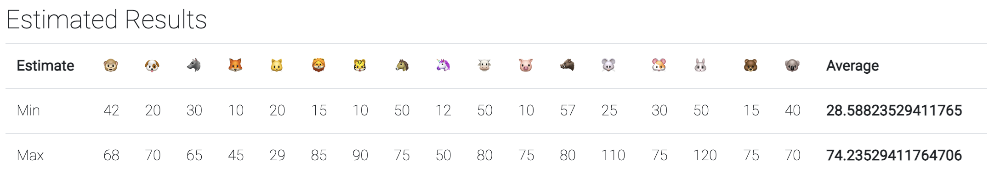

How many in-the-wild 0days will we observe in 2022?

Project Zero [maintains a list](https://docs.google.com/spreadsheets/d/1lkNJ0uQwbeC1ZTRrxdtuPLCIl7mlUreoKfSIgajnSyY/view#gid=0) of [0day vulnerabilities observed in the wild](https://googleprojectzero.blogspot.com/p/0day.html). 

They saw `57` 0days in the wild in 2021. [Retrospective analysis can be found here](https://twitter.com/maddiestone/status/1479171458307813377) and [here](https://googleprojectzero.github.io/0days-in-the-wild/rca.html). 

The following is an approach to forecasting 2022, and the points brought up by the panel discussion.

## Results

This panel expects `28.59 - 74.24` in-the-wild 0days to be discovered with 90% certainty.

A panel of 17 individuals I organized were [elicited](/risk-measurement/docs/estimation/expert-elicitation/) for a 90% [credible interval](/risk-measurement/docs/estimation/intervals/) suggesting the individual's belief of what the eventual value of 2022's observed in-the-wild 0days will be. The group has varying backgrounds in security and engineering, from industry leader to newbie. A 90% credible interval implies: 

- A 5% expectation of the true value being higher than these bounds
- A 5% chance of being lower
- A 90% chance of falling in between.

Every individual had their own opinion. All forecasts were in the form of 90% intervals. This allows the creation of a _panel belief_ using a simple average of every forecast.

We collected forecasts and debate followed afterward. Panelists were able to update their forecasts as often as they liked, as new information came through.

Put simply: _Forecast, talk, forecast again_.

## Discussion
This forecast decomposes a simple prediction ("_How many will there be?_" into a lot of interesting conversations. If we want our forecast to be correct in 2022, we need to study the uncertainties that could move this number.

First, the data represents _discovered_ 0day, not the universe of 0day that is currently exploited out there. The true denominator is not possible to count. 

However, forecasting what is measurable informs us about the more evasive denominator. We can take advantage of the opportunity a forecast gives us to be _wrong_ by discussing _how that may happen_.

The following discussions took place with panelists, which represent varying perspectives. They were all debated during the elicitation process. Consider them fodder for any comment sections discussing this forecast!

### Do we have evidence of 0day detection opportunities?
We only know about in-the-wild 0days that have been discovered. What data exists that suggest undiscovered 0days? Findings may increase rapidly if detection opportunities are taken advantage of.

[Maddie Stone's](https://googleprojectzero.blogspot.com/2020/07/detection-deficit-year-in-review-of-0.html) post on the Project Zero blog makes several important points: We have often have strong evidence that 0days exist while not having the 0days themselves to analyze. Her example discusses an 0day that was suggested by a leak at an exploit vendor. Stone eventually [hunted this vulnerability down](https://bugs.chromium.org/p/project-zero/issues/detail?id=1942).

Evidence _suggested_ the existence of this 0day being exploited before it was actually found.

Other examples exist to suggest we are missing detections. Discussed by the panel were discoveries of partial exploit chains during incident response.

Assume for a moment that we discover artifacts for an exploit, but know that further exploitation would have been required to achieve the attacker desired result... which they may have succeeded at.

An adversary may not leave behind their full exploit chain for measurement. However, the victim impact may have required one, suggesting they do exist. So, we might not have forensic evidence of an exploit. We can still make assumptions as to whether one needed to exist.

The in-the-wild 0day detection gap is an important area for study to make this area of forecasting more useful. These threads of investigation could offer insight into rates of 0day exploitation. Improving disclosure and collaboration between vendors will be necessary to get it.

### Will more companies disclose 0day exploitation?
Apple and Android began disclosing in-the-wild exploitation in 2021, sharply growing 2021's numbers. This will increase observations in the future... but by how much? These patterns may change future numbers more drastically than any change in attacker behaviors.

Whether more vendors will follow the lead is also an area to speculate. Microsoft, Google, and Apple are top contributors. Could a new vendor surge in this data?

Discussed in Stone's blog is "Clandestine" 0day reporting. This implies that patches are released and in-the-wild exploitation status is withheld from the public. If disclosure trends continue, this may increase the rate that 0days shift from clandestine to transparent disclosure about their in-the-wild status.

### Are security organizations resourcing in-the-wild 0day detection efforts?

Google TAG, Project Zero, MSTIC and MSRC made up most of the discoveries in 2021, followed by security companies. A change in 0day discovery seems likely if the resources behind these teams improve. Are these findings internally praised, will these groups grow in headcount and effectiveness?

### Will attackers continue targeting the OS and browser?
We still _detect_ most exploitation in browsers and operating systems. [Chat exploits](https://citizenlab.ca/2021/09/forcedentry-nso-group-imessage-zero-click-exploit-captured-in-the-wild/) make a minor appearance in comparison. A trend towards browsers and OS seems to be in more detectable territory, while chat applications might not be. Investment trends in attack preferences and detection capabilities against those preferences need to align for the ceiling on this interval forecast to raise. If the trends are expected to diverge, the findings may fall. 

Additionally, detection opportunity is not fairly spread across operating systems. A drop in observations may not be from a lack of exploitation. Rather, attacks may be headed towards platforms that are more difficult to investigate.

A subtle wrench: The log4j vuln. Library exploitation may suggest a desirable area for exploit research. How fast could an attacker capitalize on this, and how detectable would they be? Have attackers already found this, and will anyone discover it?

### Will detection quality improve?
This can be discussed from the perspective of defending blue teams or the developers who instrument platforms with detection capability. An expectation that blue teams are improving at detection should result in more discoveries. Similarly, if response organizations are improving at their forensic analysis, this could result in a positive change as well, especially if the desire to disclose continues to trend the way it has been.

As previously discussed, certain platforms that are already seeing empirical 0day activity may have specific plans to detect active exploitation. Those plans might have rewards over the coming year(s).

### Does the future of WFH matter? 
There are suggestions that COVID surges have made [attackers more active](https://ato.watch/2020-decade/) in the past, and fair to consider that COVID is changing productivity levels. This applies to both attacker and defender. Does it apply equally?

### Are escalation channels improving?
Targeted individuals seem to have growing channels to report suspicious activity. Citizen Lab and Amnesty have stood out as resources for potential victims (activists / journalists) of 0days, creating a modest pipeline for future 0day discoveries as they're found in-the-wild. Will these new escalation channels see comparable volume to previous years, or will they change in any direction?

*** 

## What's next?

We wait and see how 2022 shakes out. 

If you'd like, you can post your own forecast and compare with us in January 2023. Make sure you do it soon. Put your forecast on Twitter or commit it to a repository.

Our forecast will be [scored](https://magoo.github.io/risk-measurement/docs/estimation/calibration/) in January 2023. Since we've thoroughly covered the discussions we've had, we can review where we were on/off the right track.

Normally, we would use our [In The Wild](https://magoo.github.io/risk-measurement/forecasts/in-the-wild/) standards, but for this forecast we will just use Project Zero's data.

If this was useful, maybe we'll do it next year. If you'd like to be a part of future forecasts, [fill this out](https://forms.gle/6LEgpZ6kWfTx1otaA).

To receive updates on future forecasts, follow [@magoo](https://www.twitter.com/magoo) or subscribe here 👇

<iframe
scrolling="no"
style="width:100%!important;height:220px;border:0px #ccc solid !important"
src="https://buttondown.email/risk?as_embed=true"
></iframe>  