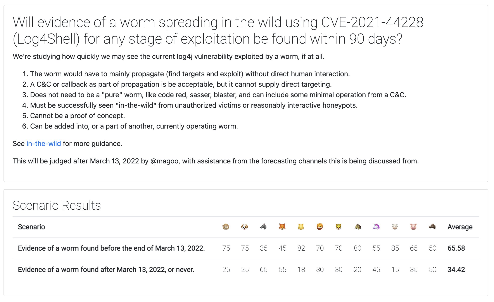

I was able to organize an early forecast during the beginnings of the log4j (CVE-2021-44228) hysteria. Some links and early timeline are available [here](https://magoo.github.io/incident-tracking/2021-12-09-log4j) if you are reading this post in the future, or aren't up to speed on this vulnerability.

This bug screamed uncertainty for a variety of reasons. I was motivated to come out of hiding and get a forecast together. Our community was not familiar with a vulnerability like this, and only caught everyone's attention after exploitation in Minecraft. It's not exploited through traditional means, yet it is still simple to exploit. 

The vulnerability was already being exploited before I could get an _[in the wild](https://magoo.medium.com/forecasting-bluekeep-5c25a8d5d681)_ forecast together. The next most interesting thing was [speculation](https://twitter.com/Laughing_Mantis/status/1470165580736987137) about whether this vulnerability would appear as a worm, which I gathered some folks up to take on with a panel forecast. 

A _meaningful_ forecast about a "worm" was really difficult to pin down. Regardless, the process of getting the measurement together was useful. It always seems to be!

First, I'll describe what scenario we landed on and the measurement process. There are many areas for improvement, which I hope I can highlight with blog posts.  

Here's the scenario we picked:

> Will evidence of a worm spreading in the wild using CVE-2021-44228 (Log4Shell) for any stage of exploitation be found within 90 days?

We measured this with an [expert elicitation](docs/estimation/expert-elicitation) approach including twelve participants and landed on a `65.58%` of occurrence. All are professionals in the security community with varying malware experience - some significant and some minor. Many of the participants were engaged in response activities for log4j and put their forecast in whilst coming up for air. 

As usual, the debate (the true goal) was useful for all of us

First, worms can use multiple means of exploitation. So we needed to be clear whether we were looking for a "full" worm that solely used CVE-2021-44228 to get around from victim to victim. Effective worms have historically used a handful of vulnerabilities to make themselves more widespread, but vulnerabilities allow for "full" worms that can roll off of a single vulnerability. So, is an existing worm that uses log4j in a minor role, a "log4j worm"? We went for an inclusive approach to make judgement (ultimately my role), easier.

Second, this vulnerability typically needs a malicious `ldap://` server, at least with the knowledge we had at the time of the forecast. Would a worm have to setup attack infrastructure with victims, or have dedicated malicious servers? This impacts whether a worm is fully "autonomous" but might still propagate quickly. Again, we decided to be inclusive of SPOF `ldap://` attack hosts and allow for dedicated attack hosts to be involved with the attack. You might see a trend in the forecast development by now.

Third, would a white-hat worm trigger this scenario? Yes, we decided not to be the judges on if something is white or black hat, and allowed it.

Lastly, would this have to be a brand new worm, or could this be added as a propagation method to an existing botnet? For instance, Mirai? Again, we decided for inclusivity.

All of these decisions to be inclusive on qualities of a "worm" all inherently add to the belief that "yes, evidence of a worm will appear". So, we ended up with a probable forecast at `65.5%`.

All of these exceptions show the need for improved demarcation on what a "worm" is for future forecasting.

A takeaway: Our interest is less interested in "Will a worm appear?" and rather more interested in size and impact of a worm within a short term period. 

What could have been more useful: 

- Exceeding victim thresholds from credible sources
- Discovery of a "full" worm 

I've drafted [some language](https://github.com/magoo/forecast-documentation/blob/master/IN-THE-WILD.md#an-in-the-wild-worm) that might be useful in the future for worm forecasting, and I'm happy to hear feedback that pokes holes in it. The details are in there, but it separates a "full" worm with a "partial" worm. A pure worm shouldn't be reliant on any external infrastructure and be fully autonomous with discovery and exploitation. A partial worm can still exhibit some of these qualities and be something to be feared, but the definition starts to slip for forecasting purposes.  

A weird exception would be the kill switch domain in WannaCry, which would have been an external dependency that would technically force it into "partial" worm status. I'm unsure how to mitigate the language that excludes it from being a "full" worm, but I think may have been one without that kill switch. Later versions without the kill switch may met the "full" definition. 

In any case, figuring out the language around "is it a worm" helps get us to more valuable information about victimization and impact. Hopefully in the future, should a worm appear, we can skip right to those forecasts. 

