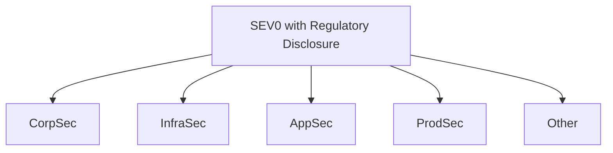
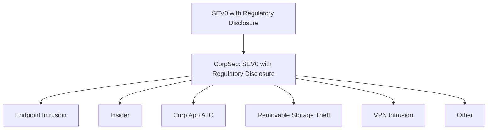

An enterprise has a lot of varying risks. We want to organize them and work collaboratively to understand them. 

What we _don't want_ is a single person or team to assess and understand _all the risks_ across an organization. Some federation of risk assessments need to occur, and we can do this by following the [third axiom](/simple-risk/docs/intro/risk/#probability) of probability when decompose a risk to share as a study.

A single engineer working in isolation should be capable of modeling a risk and developing measurements for it. However, organizations are likely to have lots of varying activities in flight that generate very different forms of risk.

Let's use a typical consumer web company for example. These companies share common risks. Here is an example  model:

1. Employee networks, applications, and devices. (Corp)
2. Infrastructure providing compute, storage, and networking. (Infra)
3. Applications that serve the business to consumers. (Product / App Sec)
4. Business logic abuse upon those products. (Spam, ATO, InfoOps, Fraud)
5. Regulatory, legal, and physical threats. (Phys. Sec, Law Enforcement, Legal)

## Federated Risk Assessment and Analysis
Let's say we begin a study of possible incidents that could occur which would require regulatory disclosure. We'll call the scenario: `SEV0 with Regulatory Disclosure`. 

Now, ask yourself: 

> What organization would be in command for our next SEV0 incident requiring disclosure?

This approach to [decomposition](/simple-risk/docs/intro/scenarios/#view-scenarios-as-a-hierarchy) allows us to break down these risks into functional organizations. Even though each team works on pretty different subject matters, we have still unified everything as a single risk. This may be useful information to leadership.  

So, how would one of the above labels be applied to a SEV0? 

This may be classified during an incident review, a postmortem or retrospective process, or simply a judgement by a CISO or other leader: "_This was clearly an incident within Infra_". 

The risk model allows us to federate this risk even further.

For example, we can request a study of `CorpSec` by others, in parallel.

A separate individual or group can wholly own and investigate risks with a top level "SEV0 with Regulatory Disclosure" requirement. They can ask themselves, "_What could take place within **CorpSec** that would result in a SEV0 and a disclosure?_" 

Now, this team or organization can be introspective about their own risks while contributing to the larger organization's goals. 

This study might look something like the following:

Because we're decomposing the same organizational scenario, we can study the model as a whole organization. 

Now we can quantify each CorpSec scenario as a fraction of the overall risk from CorpSec, and CorpSec as a fraction of the overall risk of a SEV0 with regulatory disclosure. This can happen throughout the organization, if this is desireable. 

## Ad-Hoc Approaches and modeling failures
A federated assessment can suffer the same fate as any process that elevates a single metric too highly. Eventually the model begins to lose representation of what risks an organization is concerned about.

The previous example revolves around regulatory disclosure. What if some teams are focused on reputation damage, customer churn, or civil liability? These concerns may not be captured in the model. Be careful not to put a narrow risk on a pedestal.

In these cases it makes sense to federate studies with broad organizational concerns. However, avoid larger directional that may clobber into more focused efforts. Those efforts may not be well represented by a model, but may still be mitigating risk effectively. . 