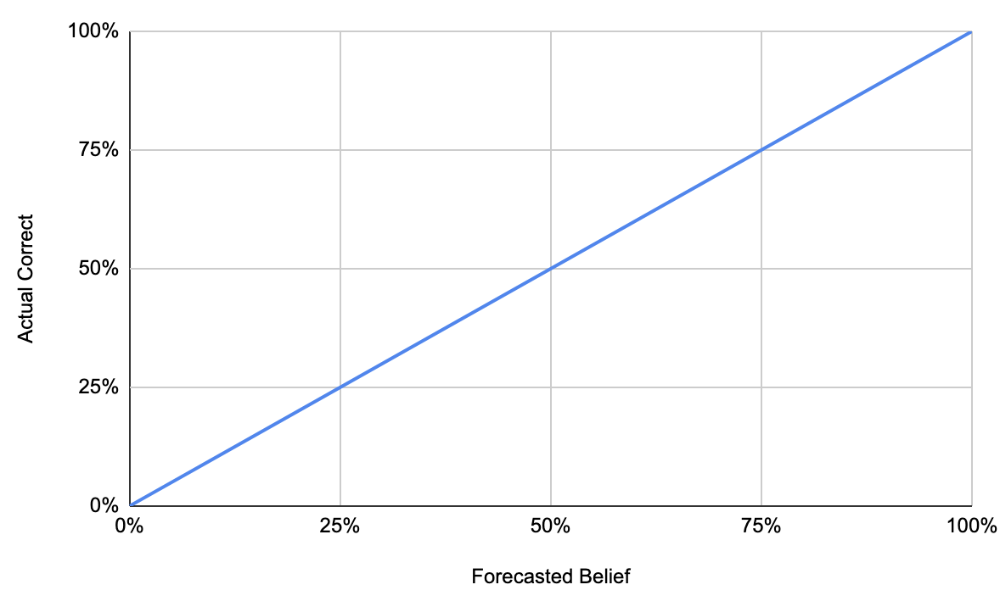
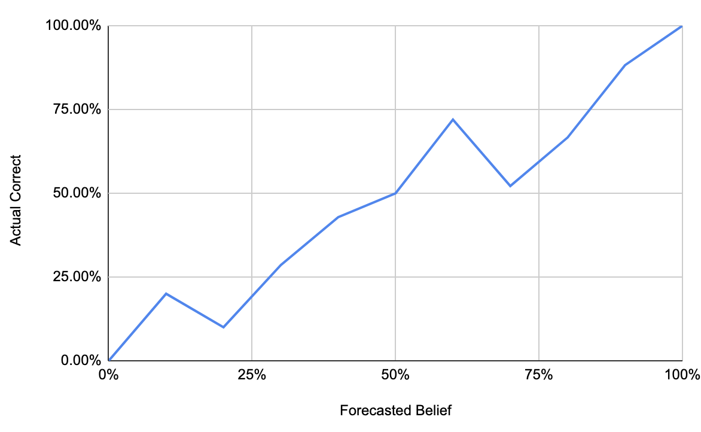

Scoring and calibration mitigates the largest weaknesses of qualitative risk methods and empowers us to correct ourselves over time. Investing in ongoing correction is an opportunity to shine over other industries that have difficulty doing so, for whatever reasons.

> Remarkably, most intelligence organizations do not proactively track their forecasting accuracy and, therefore, do not know how accurate their forecasts are or what types of biases intelligence analysts (or organizations) might exhibit. ([link](https://onlinelibrary.wiley.com/doi/abs/10.1002/ffo2.98))

## Error

Probabilistic statements are _uncertain_ and produce _error_. All probabilistic statements that are not certain (A full `100%` or `0%`) result in error. The risks we measure will hopefully have observable outcomes, and we can apply truth to these statements and calculate error, or a score.

**Score (or "error"):** The accuracy of an individual forecast when compared to hindsight.

[Chicken Little](https://en.wikipedia.org/wiki/Henny_Penny) 🐤 is an example of a low scoring forecast. Chicken Little says that the sky is absolutely going to fall, and then the sky does not fall. The forecast is incorrect and is scored poorly. Chicken Little is a demonstrably poor source of information.

**Calibration**: How trustworthy the source of a forecast is.

[The Boy Who Cried Wolf](https://en.wikipedia.org/wiki/The_Boy_Who_Cried_Wolf) 🐺 is an example of poor calibration. Repeated, high confidence claims that turn out to be false will result in poor calibration and would attract correction. A poorly calibrated individual may frequently use the phrase \"*I\'m 90% sure*\" and end up being correct a mere 10% of the time.

Decades of research show that humans are poorly calibrated without
training, practice, or corrective feedback loops. (See: [Meehl](https://en.wikipedia.org/wiki/Paul_E._Meehl#Clinical_versus_statistical_prediction), [Tetlock](https://www.newyorker.com/magazine/2005/12/05/everybodys-an-expert) and [Kent](https://en.wikipedia.org/wiki/Words_of_estimative_probability)).

Research shows that individuals are calibrated with
minimal training, and regular practice supports this as well. (See:
[Tetlock](https://github.com/magoo/forecast-documentation/blob/master/READING.md#philip-tetlocks-prediction-research). [Good Judgement](https://www.gjopen.com/))

## Keeping Score

Forecasts that include their associated confidence can make use of the
[Brier Score](https://en.wikipedia.org/wiki/Brier_score) to record
accuracy over time. This is simply calculated as the \"Squared Error\".

The Good Judgment Open has an [accessible
definition](https://www.gjopen.com/faq) of the Brier Score: :

``` none
The Brier score is the squared error of a probabilistic forecast.
To calculate it, we divide your forecast by 100 so that your probabilities
range between 0 (0%) and 1 (100%). Then, we code reality as either 0 (if the
event did not happen) or 1 (if the event did happen). For each answer option,
we take the difference between your forecast and the correct answer, square
the differences, and add them all together. For a yes/no question where you
forecasted 70% and the event happened, your score would be (1 – 0.7)2 + (0 – 0.3)2 = 0.18.
For a question with three possible outcomes (A, B, C) where you forecasted
A = 60%, B = 10%, C = 30% and A occurred, your score would be
(1 – 0.6)2 + (0 – 0.1)2 + (0 – 0.3)2 = 0.26. The best (lowest) possible
Brier score is 0, and the worst (highest) possible Brier score is 2.
```

An average Brier score is useful for tracking the reliability of a
forecaster. It can be tracked by certain topics, panels, individuals,
etc.

For instance, let\'s take a batch of some pretty good weather
predictions.

| Forecast |  % Rain | % No Rain  | Outcome | Brier Score |  Brier Score (Work)|
 --- | --- | --- | --- | --- | --- |
|1|         0.99 |               0.01|       Yes (1)|      0.0002|      ``(1-.99)^2+(0-.01)^2``|
|2|         0.8|                 0.2 |       Yes (1)|      0.08 |       ``(1-.8)^2+(0-.2)^2``|
|3|         0.334 |              0.666|      No (0)|   0.223112 |   ``(0-.334)^2 + (1-.666)^2``|
|4|         0.01|                0.99|       No (0)|   0.0002|      ``(0-.01)^2 + (1-.99)^2``|
|5|         0.95 |               0.05|       Yes (1)|      0.005 |      ``(1-.95)^2 + (0-.05)^2``|

This table shows an average Brier Score of `0.0617024`. If we observed
this forecast score from our local meteorologist, we\'d be pleased and
consider this forecast source *useful*. Let\'s put together a table of
pretty terrible weather forecasts for comparison.

| Forecast |  % Rain | % No Rain  | Outcome | Brier Score |  Brier Score (Work)|
 --- | --- | --- | --- | --- | --- |
| 1        | 0.1     |  0.9  | Yes (1) | 1.62  | `1(1-.01)\^2+(0-.9)^2` |
| 2        | 0.04    | 0.96       | Yes (1)    | 1.8432      | `(1-.04)^2+(0-.96)^2`  |
| 3        | 0.77    | 0.23       | No (0) | 1.1858      | `(0-.77)^2+(1-.23)^2`  |
| 4        | 0.88    | 0.12       | No (0) | 1.5488      | `(0-.88)^2+(1-.12)^2`  |
| 5        | 0.2     |  0.8 | Yes (1)   | 1.28    | `(1-.2)\^2+(0-.8)\^2`  |

This table shows an average brier score of `1.49556`. Any reasonable
individual would consider those forecasts *not useful*.

Your industry will vary on what a \"useful\" threshold for a forecast
source would be. For instance, a Brier Score that forecasts data related
to part failures and explosions will be very different from a risk
forecast about missed project deadlines. This documentation leaves that
up to the engineers involved to set their requirements.

However, all industries can agree that engineers seeing a reduction of a
Brier Score over time is a favorable trend.

Forecast sources can also be compared with the \"Brier Skill Score\", in
which we can discover better risk prediction models or methods. This is
heavily used in meteorology to compare the value of a predictive model
to a tried and true model, like a simple historical average. It is
expressed simply with two Brier scores being compared below.

> `BrierSkillScore = 1.0 – BrierScoreNew / BrierScoreReference`


## Calibration 

Calibration is best observed with a line chart. We graph a lot of forecasts with their average correctness, in buckets of certainty. We can then make statements like: 

> "When we're 90% sure of a future event, we're correct 90% of the time."

This chart shows that the source of forecasts (a person, a statistical model) is perfectly calibrated. When they are 10% confident, they are historically 10% correct. When they are 0% or 100% certain of an event, it will absolutely shake out that way with no mistakes.



A perfectly calibrated source of forecasts could be seriously valuable. The source's suggestions would come with great authority (especially with bold forecasts at 0% or 100%). This is not common in low information situations (like risk) and especially when dealing with human forecasts. 

The following chart demonstrates an unreliable source of forecasts. The chart communicates to us that we can't trust the judgment of the source of forecasts. The source may claim some percentage of certainty towards an outcome while their track record doesn't support it.


A more realistic and well calibrated source may have some error, but not significant, like the following:



This sort of calibration is what you might find from human sources who have been trained and have been corrected over time by calibrated themselves. 

### Volume required for calibration
Calibration can be difficult to analyze without a large volume of forecasts. Forecasts with 50% certainty can be assessed quickly, while forecasts with 99% certainty may require hundred(s) of forecasts to properly detect if they are truly have one-in-one-hundred errors or not. 

If calibration is an important value in your risk assessment methodology, you can standardize a lower level of certainty (say, 70%) to increase the ability to audit calibration.