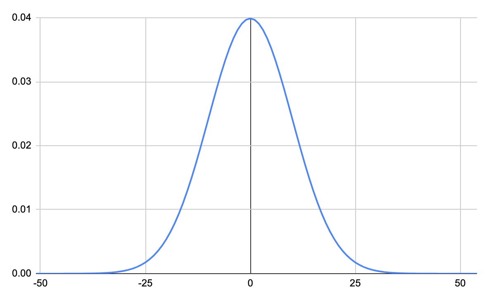

Nearly all of the estimation methods in this documentation so far are actually components that could be obtained from a probability distribution if one were available. You're likely familiar with the well known [normal distribution](https://en.wikipedia.org/wiki/Normal_distribution), shown below:

Other topics discussed so far are simple components of a probability distribution.

- A [percentile](/simple-risk/docs/estimation/percentiles) is the sum of all probabilities up to a value on a distribution.
- An [interval](/simple-risk/docs/estimation/interval) communicates two percentiles from a distribution. For instance, the `5%` and `95%` percentiles, and simply describing the probability of a value occuring within them. (For instance, a `90%` interval summarizes values in between `95%` and `5%`)

There are [plentiful options](https://www.itl.nist.gov/div898/handbook/eda/section3/eda36.htm) for studying a probability distribution elsewhere, and this documentation will focus on intuition for their use in risk measurement.


See the [elicited](github.com/magoo/elicited) library for a helpful layer to elicit parameters for these distributions.


Several distributions are useful when little is known about the behavior of an unknown risk. For instance:

A **[uniform distribution](https://www.itl.nist.gov/div898/handbook/eda/section3/eda3662.htm)** only requires a minimum and maximum boundary, and evenly spreads outcomes across all values within.

A **[triangular distribution](https://en.wikipedia.org/wiki/Triangular_distribution)** requires a minimum, a maximum, and a mode. Probability is most dense near the mode value and will not exceed the minimum or maximum.

A **[PERT distribution](https://en.wikipedia.org/wiki/PERT_distribution)** similarly uses a minimum, maximum, and mode. PERT is different from a triangular distribution that it includes a tail of values beyond the minimum and maximum values of a triangular distribution, and is continuous, and can be modified depending on goals. 

## Information Security Risk

The following section references distributions used in information security studies. 

### Incident Frequency
- **Poisson or negative binomial**: Martin Eling and Nicola Loperfido. 2017. Data breaches: Goodness of fit, pricing, and risk measurement. Insur. Math. Econ. 75 (2017), 126–136.

### Losses
- **Gamma**: [The County Fair Cyber Loss Distribution: Drawing Inferences
  from Insurance Prices](https://dl.acm.org/doi/pdf/10.1145/3434403)
- **Power Law**: Thomas Maillart and Didier Sornette. 2010. Heavy-tailed distribution of cyber-risks. Eur. Phys. J. B 75, 3 (2010), 357–364.
- **Lognormal** : Benjamin Edwards, Steven Hofmeyr, and Stephanie Forrest. 2016. Hype and heavy tails: A closer look at data breaches. J. Cybersecur.
  2, 1 (2016), 3–14
- **Pareto**: Spencer Wheatley, Thomas Maillart, and Didier Sornette. 2016. The extreme risk of personal data breaches and the erosion of privacy.
  Eur. Phys. J. B 89, 1 (2016), 7.
- **Log-skew-normal**: Martin Eling and Nicola Loperfido. 2017. Data breaches: Goodness of fit, pricing, and risk measurement. Insur. Math. Econ. 75 (2017),  126–136.
- **Lognormal and Generalized Pareto**: Antoine Bouveret. 2018. Cyber Risk for the Financial Sector: A Framework for Quantitative Assessment. International Monetary Fund.

### Bugs / Vulns / Bounty
- **Power Law**: [Given Enough Eyeballs, All Bugs Are Shallow?
Revisiting Eric Raymond with Bug Bounty Programs](https://weis2016.econinfosec.org/wp-content/uploads/sites/2/2015/08/WEIS_2016_paper_76.pdf)
- **Poisson**: [Enter the Hydra: Towards Principled Bug Bounties and Exploit-Resistant
Smart Contracts∗](https://eprint.iacr.org/2017/1090.pdf)

> Message @magoo for anything that should be added.
