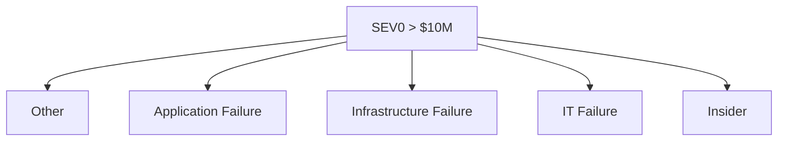

We want our teams to work in a unified direction. This section describes codifying that direction as a risk. Codifying a risk is similar to selecting a KPI or setting an objective.

These directional risks should be broad. There shouldn't be many of them, as we're using it to provide a meaningful north star. Using [incident classification](https://response.pagerduty.com/before/severity_levels/) (`SEV`, `P0`, etc) helps clarify what _incident_ means, as well as thresholds of other undesirable things like costs or losses.

Some ideas on _directional_ scenarios:

-   `> N` regrettable customer exits resulting from a `SEV0`.
-   Any party in `{set of regulators}` formally discusses a `SEV0` with us.
-   A `SEV0` with `>$X Million` in losses. 
-   Any `{set of bloggers and newspapers}` publishes commentary on a `SEV0`.
-   A `SEV0` has confirmed, unauthorized access to `customer data`.
-   `>% of total users` impacted by a `SEV0` involving an [explicitly defined failure](https://www.microsoft.com/en-us/msrc/windows-security-servicing-criteria).

These are examples and some will resonate while others will not. The creation and selection of a _good_ scenario is a leadership task. 

From here, decomposition allows us to sniff out hot areas of risk where large causal areas form. We can do this so long as we follow [probabilistic axioms](/docs/intro/risk/#probability), especially the third axiom of mutually exclusive events. This means our decomposition needs to be Mutually Exclusive and Collectively Exhaustive (MECE in business speak).

Let's assume we have forecasts to support this breakdown. Because we're breaking down all possibilities for the `SEV0 > $10M` scenario, the following need to equal 100%.

 1. 🏆 IT Failure: 40%
 2. Application Failure: 25%
 3. Infrastructure Failure: 20%
 4. Other: 10%
 5. Insider: 5%
  
It looks like IT Failures make up a lot of the risk here. But why do all of this work?

Management-through-metrics is a focus area where troubling patterns can sometimes be found in an organization. Be careful with performance incentives based on reductions to subjective risk measurements.

There are [many issues with strict quantitative leadership](https://magoo.medium.com/risk-and-performance-management-1e56ef870b31) which may make it into this documentation in the future.

1. Risk based knowledge work resists simple performance measurement.
2. Knowledge workers are trusted to measure and manage themselves.
3. OKRs and peer reviews are crucial for evaluating a knowledge worker.
4. Objective measurement is efficient, but risk is a subjective concern.
5. Overly quantitative management becomes subjected to Goodhart’s Law.

Rather, we are concerned about encouraging and organizing behaviors that decompose the KPI. A quantitative risk used as a KPI provides direction, and creates an organizational obligation to discover where the contributors to that risk come from. 

For instance, a high performing engineer will demonstrate the relationship of their efforts to how their efforts in finding and mitigating risks relate to informing the KPIs.

Similarly, a directional risk scenario can help engineers self-organize around clearly identified risks and the causes that contribute to them. Product organizations do this similarly with directly measurable metrics (Monthly Recurring Revenue, Monthly Active Users, etc) and we're simply doing the same with a synthetic metric.