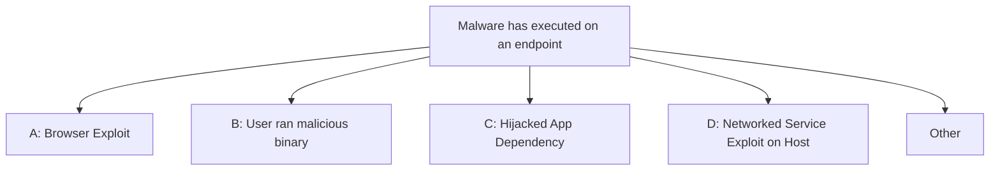

We use **scenarios** to specifically define future events and impacts that we\'d
like to measure. This must happen before we start measurement, either through the collection of historic data or through [expert elicitation](/docs/estimation/expert-elicitation).

In our discussion about [risk](/docs/risk/problems) we discussed the *likelihood* and *impact* of a future
event, as `r = p * i`

A point of failure in measurement is ambiguity about a risk problem
being solved. A group of very smart people can spin in circles
discussing a risk if they don\'t pin a specific outcome down first.

Until we define a scenario, `r = p *i` is not useful. 

To do this, we explicitly define a risk with a *scenario*, which is an
unambiguous statement about an undesireable future event.

A scenario can have multiple *outcomes* to be estimated. For instance,
an explosion may have costs, loss of life, or periods afterward spent offline.

Here\'s a batch of examples:

**Scenario** :
We disclose an incident to a regulator next quarter.



**Scenario** :
Employees at a datacenter are unreachable during an incident next year.



**Scenario** :
We are named in a lawsuit covered by a major newspaper next quarter.


Scenarios should be familiar because many industries advocate for the [tabletop
scenario](https://www.ready.gov/business/testing/exercises) as a way to
encourage brainstorming and better understanding of risks.

## Always include a specific timeframe.

We must include a specific timeframe with our scenarios. A risk can be
viewed completely differently if it described as something happening
tomorrow, or within the next ten years. Discussing scenarios without
specific timeframes will cause communication and prioritization issues.

## View scenarios as a hierarchy.

A scenario has ties to the [Fault
Tree](https://en.wikipedia.org/wiki/Fault_tree_analysis) and [Tree
diagram](https://en.wikipedia.org/wiki/Tree_diagram_(probability_theory)),
whereas higher level outcomes at the top of a tree aggregate the
likelihoods of more specific events at the branches of a tree. Doing so keeps us compatible with quantitative risk methods, as it follows an [axiom of probability](/docs/intro/risk/#probability). 

Here, we breakdown the methods that malicious code could have executed on an endpoint.

This is described as _decomposing_ a risk. Decomposition offers
flexibility in scenario building. With this flexibility, one could
target broad failures, or more narrow ones, by being more or less
precise with language. 

The process of decomposing a risk with a group is sometimes the most useful part of quantitative risk exercises.

However, a _modeling assumption_ is that these decompositions are mutually exclusive and are not in violation of the [third probabilistic axiom](/docs/intro/risk/#probability). 

Here's an example of a model failure: The adversary _could_ exploit a service on an endpoint over the network and (sigh) use this access to double click malware that they've emailed to same victim. Of course, this would be a bit roundabout and would bypass our model... but there may be situations that do not. 

In these cases, we would classify it as "Other", which is a catch-all for failures of the imagination. Some models will have a larger presence of "Other" that others due to our familiarity with risks. We still classify incidents that occur in "Other" as an area for model improvement.

This weakness of probabilistic models is not necessarily a bad thing if it still drives mitigation efforts in the desired way.

In [Enterprise](/docs/enterprise/organizing-risks/) this
aspect of scenarios-informing-scenarios is used to inform larger
organizational approaches to risk.

A principle of scenario building (see: [Limitation](docs/other/principles/#Limitation) is to assume that unknown scenarios may occur. Erring
towards upward investment in a hierarchy of scenarios helps defend
against \"unknown\" branches. The initiating events that create complex
problems can sometimes not be predicted, and assuming large forms of
failure can help prevent disaster.

We can use this flexibility to model risks and measure them. We can
decompose a risk with greater resource and available effort, but not so
much that we lose sight of our risks and become vulnerable to
uncertainty that was not accounted for.

## Outcomes and Judgments

One issue in forecasting is deciding on the criteria that \"closes\" a
forecast. For instance:


**Scenario** : We disclose an incident to a regulator next year.


This scenario is simple to judge, as you would likely respect the
judgment your legal counsel as to whether this occurred. No trouble here. Though, is important to identify how a scenario will be judged. 

The \"judge\" becomes part of the forecast, and may influence the certainty of the forecasters if the judge is biased or unreliable.

The judges that are selected to evaluate outcomes should be considered
for their impartiality to the outcome, and we want scenarios to be very specific.

Designate a team or individual to pass judgment on an
outcome when no clear judgment exists.

If there is concern that a Black Swan may invalidate the forecast, it is
best to make sure the forecastable outcomes include \"other\"
circumstances. For instance: 

1. We disclose an incident next year.
2. We don't disclose an incident next year.
3. Other

This would allow you to continue judgement under difficult to imagine circumstances. Additionally, decisions can reverse. Write defensible scenarios that mitigate flip-flopping of an outcome. 

Perhaps the regulator decides that the incident does not qualify as an incident, and there is a desire to retroactively invalidate the scenario.

The reliability of judgment can also be bolstered to decision makers if
included in whistleblowing policy or professional codes of conduct.
(See: [whistleblowing](/docs/enterprise/rigor/#whistleblowing-and-complaints))