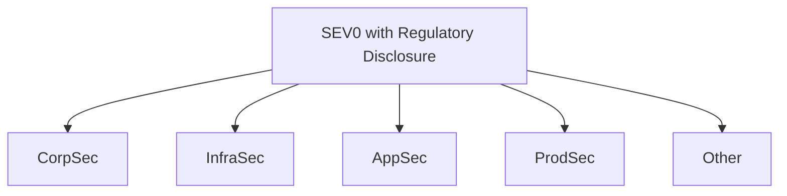
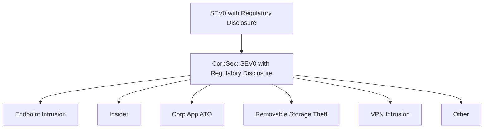

An enterprise has a lot of varying risks. How can you organize them so they're tractable by large organizations? Risk measurement can be viewed as a group practice. Risks should be decomposable and delegated in order to offer insight at scale.

Phrased differently: We don't expect a single person or team to assess and understand _all the risks_ across an organization. Some federation of risk assessments need to occur, and we can do this by following the [third axiom](/docs/intro/risk/#probability) of probability when we break apart a risk.

From the [principles](/docs/other/principles/) of
this documentation, a single engineer working in isolation should be
capable of modeling a risk and developing measurements.

However, organizations are likely to have lots of varying activities in flight
that generate very different forms of risk. 

Let's use a typical web-tech company for example, which has common problem areas that could be modeled in a variety of different ways. Here is an example  model:

1. Employee tooling and devices. (CorpSec)
2. Infrastructure providing compute, storage, and networking. (InfraSec)
3. Applications that serve the business to consumers. (RCE, IDOR, SQLi) (AppSec)
4. Abuse upon those products. (Spam, ATO, InfoOps, Fraud) (ProdSec)
5. Regulatory, legal, and physical threats. (Phys. Sec, Law Enforcement, Legal)

## Federated Risk Assessment and Analysis
Let's say we begin a study of possible incidents that could occur which would require regulatory disclosure. We'll call the scenario: `SEV0 with Regulatory Disclosure`. 

If we were to judge what type of incident the scenario was based on the labels above, what would be the area with the most risk?

Probabilistic scenarios can be [decomposed as a hierarchy](/docs/intro/scenarios/#view-scenarios-as-a-hierarchy) and allow us to break down these risks into function organizations. Despite the variance in all of these disciplines, we may still be concerned with measuring the probability of a SEV0 requiring regulatory disclosure to any party. 

So, how would one of these labels be applied to a SEV0? This may be classified during an incident review, a postmortem or retrospective process, or simply a judgement by a CISO or other leader.

This risk model allows us to federate this risk to be studied under `CorpSec` by another group. CorpSec can wholly own and investigate risks with a top level "SEV0 with Regulatory Disclosure" requirement. They can ask themselves, "_What could take place within CorpSec that would result in a SEV0 and a disclosure?_" 

Now, this team or organization can be introspective about their own risks while contributing to the larger organization's goals. 

This study might look something like the following:

Because we're decomposing the same organizational scenario, we can study the model as a whole organization. 

Now we can quantify each CorpSec scenario as a fraction of the overall risk from CorpSec, and CorpSec as a fraction of the overall risk of a SEV0 with regulatory disclosure.

## Ad-Hoc Approaches
Federated assessments suffer the same fate as any process revolving around a single metric. Eventually the model begins to lose representation of what risks an organization is concerned about.

The previous example revolves around regulatory disclosure. What if some teams are focused on reputation damage, customer churn, or civil liability? These concerns may not be captured in the model. 

In these cases it makes sense to federate studies with broad organizational concerns, but these larger directional efforts should not clobber with more focused efforts to manage risk where the model does not shine.